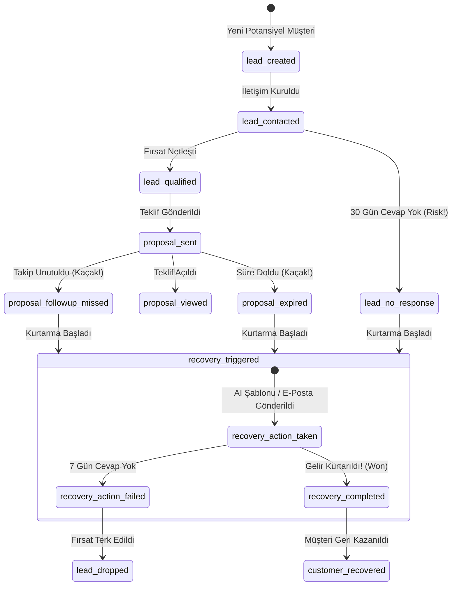

# Revenue Recovery Intelligence Platform: Nihai Operasyonel ve Stratejik Mimari Tasarımı (Master Blueprint)

Bu belge, paylaştığınız **1. Sistem Mimarisi Analizi** ve **2. Olay Güdümlü (Event-Driven) Operasyonel Mimari Analizi** verilerini sentezleyen, projenizin en verimli, en hızlı ölçeklenebilir ve **"hemen satın alınabilir" (yüksek dönüşüm oranlı / high-converting)** ticari versiyonunu oluşturmak için tasarlanmış nihai sistem mimarisi rehberidir.

---

## 1. ÜRÜNÜN TİCARİ VE OPERASYONEL FELSEFESİ

Müşterinin ürünü görür görmez **"Hemen Satın Almalıyım / Kullanmalıyım"** demesini sağlayacak temel felsefe şudur:

> **"Kullanıcıya veri sunup analiz etmesini beklemeyiz. Kullanıcıya nerede para kaybettiğini net bir fatura gibi gösterir, kaybın nedenini (Event) teşhis eder ve tek tıkla kurtarmasını (Action) sağlarız."**

* **Ürün Bir Gösterge Paneli Değildir:** Müşterinin zaten onlarca paneli var. Bu ürün bir **"Gelir Kurtarma Motorudur (Action-Driven Engine)"**.
* **ROI Odaklı Değer Sunumu:** Kullanıcı sisteme girdiği an (CSV yükleyerek veya manuel girişle) karşısına çıkacak ilk sayı: **"Kaybedilen/Unutulan Toplam Geliriniz: $14,500"** ve hemen yanında **"Bunun %45'ini ($6,525) hemen bugün kurtarabilirsiniz!"** olmalıdır.

---

## 2. OLAY GÜDÜMLÜ OPERASYONEL MOTOR (EVENT-DRIVEN ENGINE)

Sistem, işletmenin geçmiş verilerini veya CRM kayıtlarını taradığında aşağıdaki olayları (event) tespit eder. Phase 1'de bu olaylar tarayıcıda simüle edilir, Phase 2'de ise veritabanı ve otomasyon seviyesinde gerçek zamanlı çalışır.



### Olayların Teşhis ve Aksiyon Karşılıkları:
Sistem her olayı bir **Gelir Kaçağı (Revenue Leakage)** olarak işaretler ve karşısına anında aksiyon üretir:

| Tespit Edilen Olay (Event) | İşletme İçin Anlamı (Leakage) | Kurtarma Aksiyonu (Recovery Action) |
| :--- | :--- | :--- |
| **`proposal_followup_missed`** | Teklif verilmiş ama takip araması/maili unutulmuş. | **AI Kurtarma Mesajı:** Fiyat pürüzünü çözen, baskısız, nazik hatırlatma. |
| **`lead_no_response`** | Müşteri adayı yazmış ama süreç soğumaya bırakılmış. | **Sıcak Temas Mesajı:** İhtiyacın güncelliğini sorgulayan akıllı soru. |
| **`customer_inactive`** | Eski müşteri 90 gündür alışveriş yapmamış (Churn riski). | **Güven Tazeleme Mesajı:** Satış kokmayan, ilişki tazeleyici kahve daveti. |

---

## 3. PHASE 1 VS. PHASE 2 ADIM ADIM GEÇİŞ PLANI (MİGRATION)

Geliştirme hızını tavan yaptırmak ve bütçeyi korumak için iki aşamalı planımız kusursuz bir şekilde entegre edilmiştir:

### 🚀 PHASE 1: "Sıfır Maliyetli Doğrulama" ($0 Stack)
Bu aşamada sunucu, veritabanı kurulumu ve karmaşık API'lerle vakit kaybetmeyiz. Uygulama tamamen **tarayıcıda (Client-side)** çalışır.

* **Frontend & Hosting:** GitHub Pages (Şu an aktif ettiğimiz altyapı) - **$0**
* **Analiz Motoru:** React/Vite içerisindeki yerel parser. CSV dosyası tarayıcıda okunur, Javascript ile yukarıdaki Event kurallarına göre analiz edilir. Veriler asla bilgisayar dışına çıkmaz (Hız: <1 saniye, Güvenlik: %100 gizlilik).
* **Veritabanı & Backend:** **İhtiyaç Yok (Simüle Ediliyor).**
* **Lead Capture & E-posta:** **Resend API**. Kullanıcı analiz sonuçlarını ve AI kurtarma şablonlarını indirmek istediğinde e-postasını yazar. Sistem bu e-postayı ve analiz özetini Resend üzerinden bize mail olarak atar (böylece müşteri listemiz bütçesiz birikir).

### 📈 PHASE 2: "Ölçekleme ve Otomasyon" (Hostinger VPS / Coolify)
Ürün ilk müşterilerini kazanıp gelir getirmeye başladığında, tek bir kod satırını bozmadan sunucu mimarisine geçiş yaparız.

* **Altyapı:** Hostinger VPS (Sabit $8-9/Ay, sürpriz faturasız).
* **Yönetim:** **Coolify PaaS**. GitHub deponuzu VPS'e bağlayıp otomatik kesintisiz deploy sağlar.
* **Veritabanı:** **PostgreSQL (Self-hosted inside VPS)**. Kullanıcı verileri, geçmiş yüklemeler ve loglar sunucuda güvenle saklanır.
* **Gerçek Zamanlı Otomasyon:** **Redis + BullMQ**. Kullanıcı verilerini bağladığında (örneğin API ile), sistem arka planda her gece verileri tarar, otomatik olarak olayları (`proposal_followup_missed` vb.) tetikler ve kullanıcının yerine takipleri otomatik yapar.

---

## 4. KULLANICI AKIŞI VE DÖNÜŞÜM TASARIMI (UX / CONVERSION FLOW)

Kullanıcının ürünü görür görmez **"Hemen Satın Almalıyım"** hissiyatına kapılması için akış şu şekilde kurgulanmıştır:

```
[1. Landing Page] (Problem Farkındalığı)
       │
       ▼
[2. CSV Yükleme / Manuel Giriş] (Sıfır Kayıt Bariyeri - Hemen Değer)
       │
       ▼
[3. Instant Analysis & Teşhis] (Göz Kamaştırıcı Grafik & Kayıp Faturası)
       │  - "Toplam Kaybınız: $14,500"
       │  - "En Kritik 3 Kurtarma Aksiyonu Hazır!"
       ▼
[4. E-posta Bariyeri / Lead Capture] (Ücretsiz Kayıt Ol / Raporu Mail At)
       │  - "AI Taslaklarını İndirmek ve Otomatik Kurtarmayı Açmak İçin Giriş Yap"
       ▼
[5. Insight Dashboard & CTA] (Satın Alma / Abonelik)
```

---

## 🏁 YOL HARİTASI VE İLK KODLAMA ADIMLARI

Bu stratejik tasarımı onayladığınızda, projemiz üzerindeki ilk somut geliştirmelere başlayabiliriz. Öncelikli adımlarımız:

1. **Arayüz Geliştirmesi:** Landing page ve CSV yükleme ekranının " premium Vercel-style" karanlık mod tasarımıyla zenginleştirilmesi.
2. **Yerel Analiz Motoru (Local Engine):** Yüklenen CSV verilerini tarayıcıda okuyup `proposal_followup_missed`, `customer_inactive` ve `lead_no_response` olaylarına göre analiz eden ve kayıp ciro çıkaran Javascript motorunun yazılması.
3. **Kurtarma Aksiyon Ekranı:** AI tarafından yazılmış gibi dinamik kurtarma e-postası şablonlarını kullanıcıya gösteren panelin kodlanması.

Bu mükemmel sentezlenmiş **Nihai Mimari Planı** onaylıyor musunuz? Eğer onaylarsanız, hemen kodlama aşamasına geçelim!
